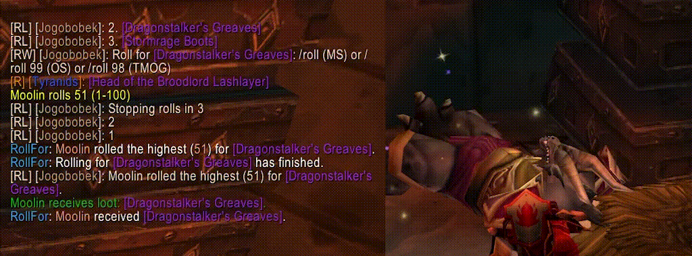
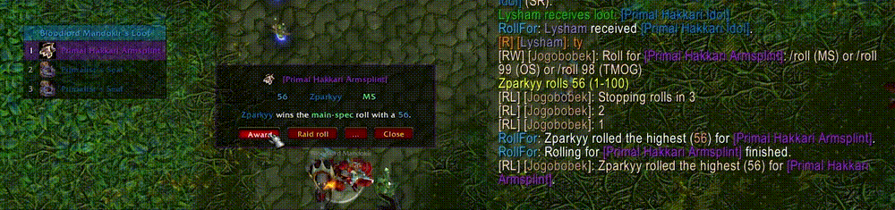
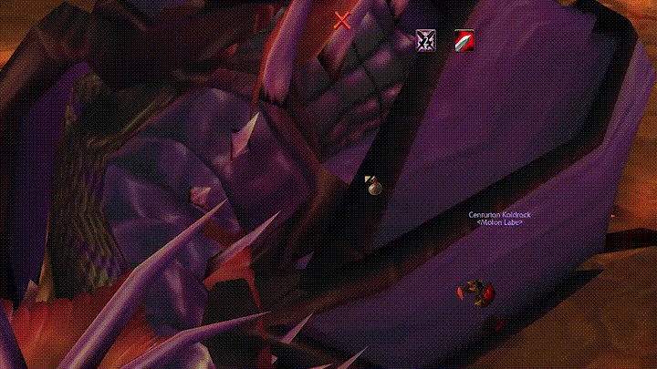
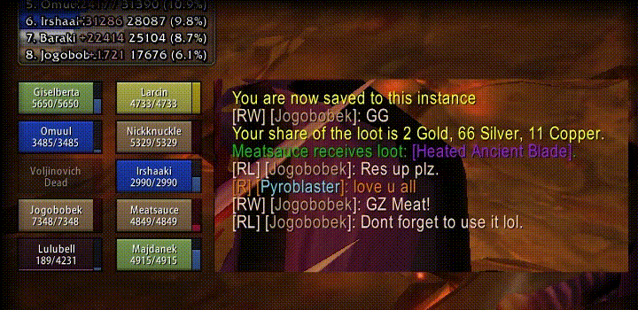
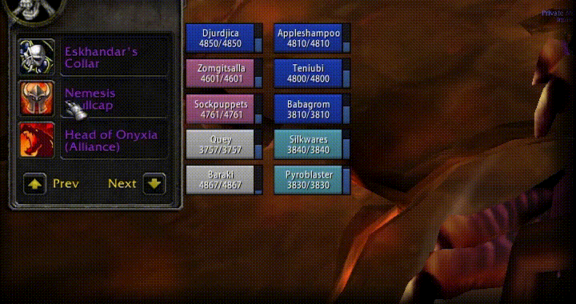
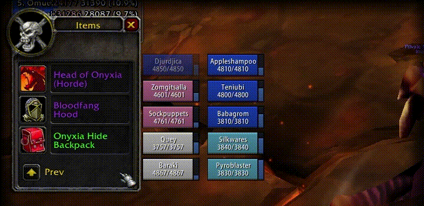
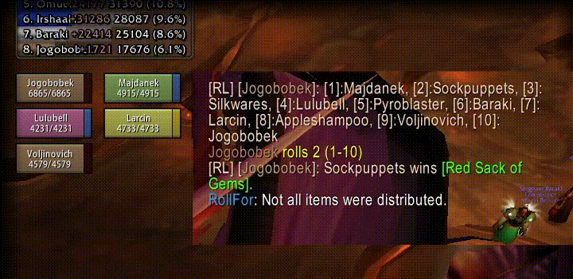
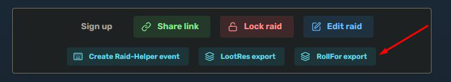
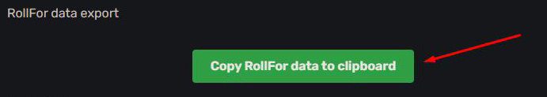
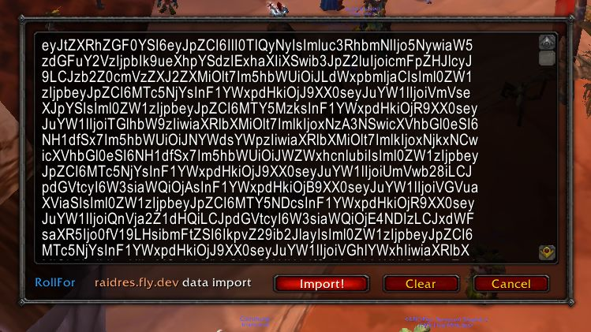

# RollFor
The **official** repository of RollFor, a World of Warcraft (2.5.6) addon that manages rolling for items.

## Installing

Download `RollFor.zip` from [Releases](https://github.com/rollfor/rollfor/releases) and unpack it
into `Interface/AddOns`. It contains RollFor and the extensions below; disable the ones you
don't want in the game's AddOns list.

## Extensions

In `RollFor.zip`:

| Addon | What it does |
|---|---|
| [RollForSoftRes](RollForSoftRes/README.md) | Soft-res list, import window and `/sr` commands |
| [RollForSoftResIt](RollForSoftResIt/README.md) | Reads softres.it exports |
| [RollForRaidRes](RollForRaidRes/README.md) | Reads raidres.top exports |
| [RollForAutoLoot](RollForAutoLoot/README.md) | Master-loots ticked items to yourself |
| [RollForGargul](RollForGargul/README.md) | Shows RollFor's rolls and soft-res data to Gargul users |

Downloaded separately:

| Addon | What it does |
|---|---|
| [RollForSrPlusRaidres](https://github.com/rollfor/sr-plus-raidres) | Adds raidres.top SR+ points to rolls |
| [RollForAutoRobin](https://github.com/rollfor/auto-robin) | Hands selected items out in a rotation |
| [RollForPendingLoot](https://github.com/rollfor/pending-loot) | Lists looted items not yet handed out |
| [RollForNetherVortex](https://github.com/rollfor/nether-vortex-sr) | Soft-res rules for Nether Vortex |
| [RollForBtSrLimitCheck](https://github.com/rollfor/bt-sr-limit-check) | Checks Black Temple's soft-res budget |

## Demo

### Classic Look

See the classic-look in action: https://youtu.be/G37j5XXBKxs

### Overview

The addon shows the soft-reserved items in the loot list. The Master Looter raid-rolls the
trash item, then rolls non-SR items, then the SR items.

View better quality (fullscreen): https://youtu.be/f5nY-CxreIM

### Tie roll

An item soft-reserved by two players: only they can roll, and a tie is resolved automatically.
The Master Looter then assigns the item directly to the winner.

### Two top rolls win

Clicking either of two identical items selects both and runs a "two-top-rolls-win" roll, with
an award button for each winner.

## Features

### Fully SR-integrated loot list

### Automatically enables Master Loot when a boss is targeted
Disable with `/rf config auto-master-loot`.

### Shows the loot that dropped (and who soft reserved)

### Makes Master Loot window pretty and safe
* one window with players sorted by class
* adds confirmation window

### Fully automated
* Detects if someone rolls too many times and ignores extra rolls.
* If multiple players roll the same number, it shows it and waits for them to re-roll.

### Soft res integration
* `RollForSoftRes` holds the list, with `RollForSoftResIt` and `RollForRaidRes` reading
  [softres.it](https://softres.it) and [raidres.top](https://raidres.top) exports. See
  [RollForSoftRes/README.md](RollForSoftRes/README.md).
* Minimap icon shows soft res status and who did not soft res.
* Only accepts rolls from players who soft-reserved the item.

### And more
* Supports "**two top rolls win**" rolling.
* Supports **raid rolls**.
* Supports offspec rolls (`/roll 99`).
* Automatically resolves tied rolls.
* Highly customizable - see `/rf config` and `/rf config help`.

### See it in action
https://youtu.be/vZdafun0nYo

## Usage

| Command | What it does |
|---|---|
| `/rf <item link>` | Roll for an item |
| `/rf 2x<item link>` | Roll for 2 items (two top rolls win) |
| `/arf <item link>` | Roll, letting everyone roll even if the item is soft-reserved |
| `/rr <item link>` | Raid-roll an item from your bags |
| `/irr <item link>` | Insta raid-roll an item from your bags |
| `/fr` | Finish rolls early |
| `/cr` | Cancel rolls |

## Soft-Res setup

1. Create a Soft Res list at https://softres.it.
2. Ask raiders to add their items.
3. When ready, lock the raid and click on the **Gargul Export** button.

4. Click on **Copy RollFor data to clipboard** button.

5. Click on the minimap icon or type `/sr`.
6. Paste the data into the window.
7. Click **Import!**.

If someone needs to update their items, repeat the process.

Hovering over the minimap icon tells you who did not soft-res. The icon is:
* **green** if everyone in the group is soft-ressing,
* **orange** if someone has not soft-ressed,
* **red** if the soft-res data is outdated,
* **white** if there is no soft-res data.

| Command | What it does |
|---|---|
| `/srs` | Show soft-ressed items |
| `/src` | Check who in the group is not soft-ressing |
| `/sro` | Fix a player name the addon couldn't match (it fixes simple typos itself) |
| `/sr init` | Clear soft-res data (or **Clear** from the minimap icon) |

## Shoutouts

Thank you to:
  * **Turtle WoW devs** for amazing content. RIP
  * **Itamedruids** for *Raidres* and adding the export function. Love your work.
  * My fellow raiders (there's too many to mention).
  * All bug reporters, testers and feature suggesters.

## Need more help?

The best way to contact me is to message me on Discord.
Username: **Obszczymucha**
